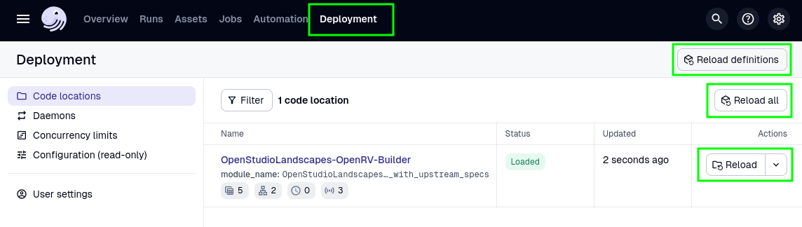
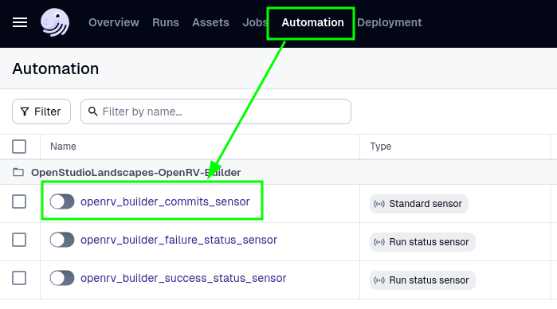
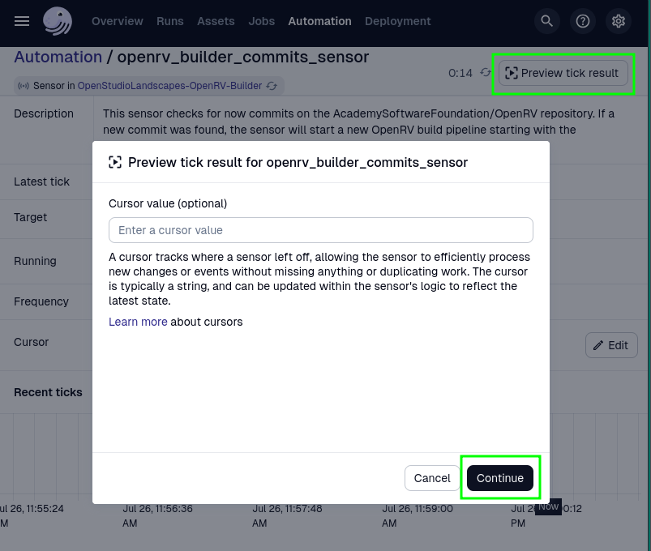
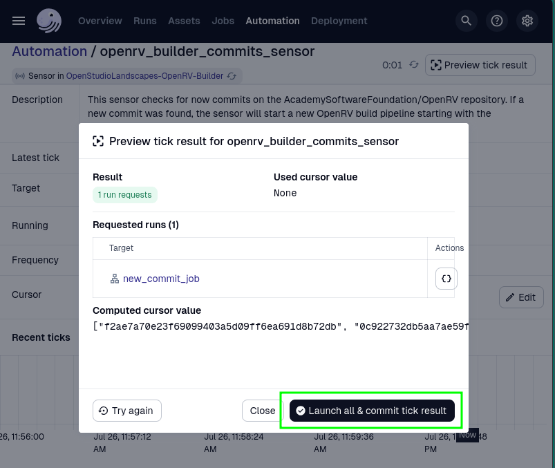
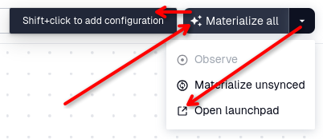
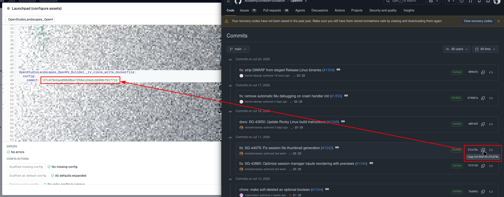
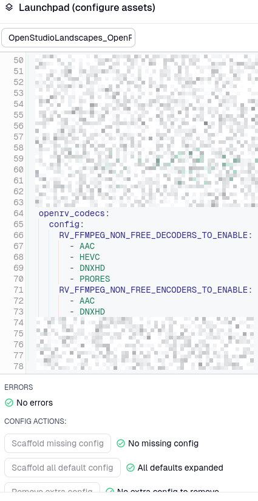
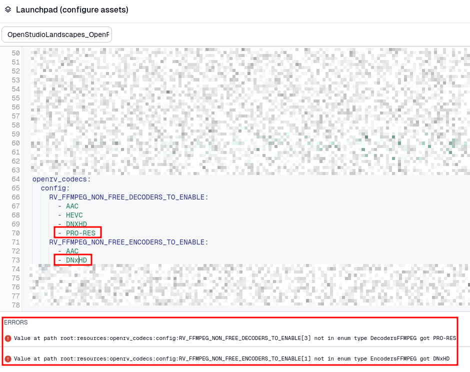
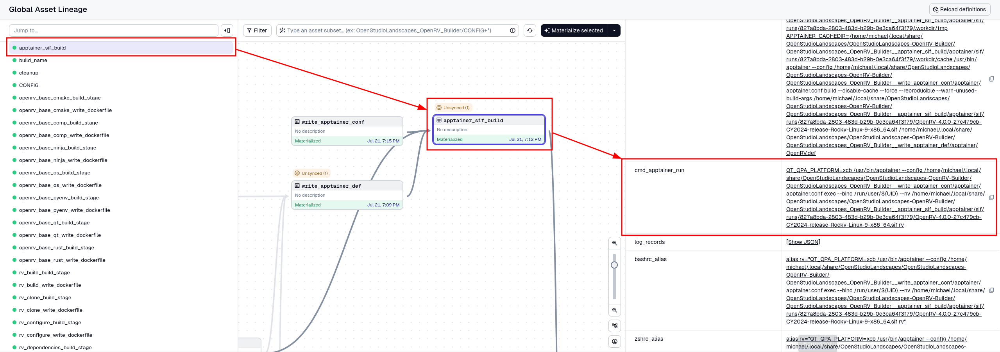
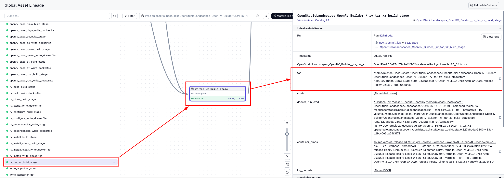

[](https://github.com/michimussato/OpenStudioLandscapes) 💙 [](https://github.com/AcademySoftwareFoundation/OpenRV.git)

---

<!-- TOC -->
* [OpenStudioLandscapes-OpenRV-Builder](#openstudiolandscapes-openrv-builder)
  * [Brief](#brief)
  * [Requirements](#requirements)
  * [Configuration Files](#configuration-files)
  * [Install](#install)
    * [Clone](#clone)
    * [Create venv](#create-venv)
    * [Run Standalone](#run-standalone)
      * [Option 1 (Quick Start): Launch Dagster Dev Server](#option-1-quick-start-launch-dagster-dev-server)
      * [Option 2: Launch Dagster Daemon (with optional `dagster-webserver`)](#option-2-launch-dagster-daemon-with-optional-dagster-webserver)
        * [Launch Daemon](#launch-daemon)
        * [Launch Webserver](#launch-webserver)
    * [Run as gRPC Code Location](#run-as-grpc-code-location)
      * [Launch gRPC Code Location](#launch-grpc-code-location)
      * [gRPC Client Setup for OpenStudioLandscapes](#grpc-client-setup-for-openstudiolandscapes)
  * [Configure](#configure)
    * [ConfigurableResource: `OpenRVCodecsResource`](#configurableresource-openrvcodecsresource)
    * [ConfigurableResource: `OpenRVBuilderResource`](#configurableresource-openrvbuilderresource)
  * [Automated Builds](#automated-builds)
  * [`ntfy.sh` Notifications](#ntfysh-notifications)
    * [Configuration](#configuration)
  * [`.env`](#env)
    * [Load the Environment Variables manually](#load-the-environment-variables-manually)
  * [Manual Builds](#manual-builds)
    * [Trigger Sensor and build](#trigger-sensor-and-build)
    * [Build to Commit](#build-to-commit)
      * [Customize Options](#customize-options)
  * [Resulting Files](#resulting-files)
    * [Apptainer SIF](#apptainer-sif)
    * [Tarball](#tarball)
  * [Systemd Unit](#systemd-unit)
* [Known Issues](#known-issues)
  * [Docker: `[output clipped, log limit 2MiB reached]`](#docker-output-clipped-log-limit-2mib-reached)
  * [`stderr: the input device is not a TTY`](#stderr-the-input-device-is-not-a-tty)
* [RnD](#rnd)
  * [Investigate running GitHub Actions locally](#investigate-running-github-actions-locally)
    * [`act`](#act)
  * [Investigate Dagster Automation](#investigate-dagster-automation)
<!-- TOC -->

---

# OpenStudioLandscapes-OpenRV-Builder

> [!NOTE]
> 
> This is a work in progress so **pull often**. If you find a bug or
> wrong/incomplete information, please feel free
> to create an issue.

## Brief

> [!TIP]
> 
> This is a pluggable, yet fully standalone 
> [OpenRV](https://github.com/AcademySoftwareFoundation/OpenRV) build system designed to best fit into the
> [**OpenStudioLandscapes**](https://github.com/michimussato/OpenStudioLandscapes) 
> ecosystem.
>
> [](https://github.com/michimussato/OpenStudioLandscapes)

The underlying foundation of this builder is [Dagster `v1.9.11`](https://release-1-9-13.archive.dagster-docs.io/). 
It is strongly recommended to get yourself familiar with Dagster.
[This is a good starting point](https://github.com/michimussato/OpenStudioLandscapes-Dagster#getting-started-with-dagster).

It is designed as an external Dagster [Code Location](#run-as-grpc-code-location) 
and can run on any `x86_64` Linux machine with the (quite considerable)
storage requirements for a successful OpenRV build:
- ~150 GB disk space

> [!TIP]
> 
> If you run out of memory during the build process, reducing 
> `RV_BUILD_PARALLELISM` might help

However, **OpenStudioLandscapes-OpenRV-Builder** can also be used as an
independent [standalone build system](#run-standalone).

Builds for:
- [x] [Rocky 9 (Tarball)](#tarball)
- [x] [Apptainer](#apptainer-sif)

Todo:
- [ ] Build for MacOS
  - Potential resources:
    - https://hub.docker.com/r/dockurr/macos/
    - https://github.com/dockur/macos
- [ ] Build for Windows
  - Potential Resources:
    - https://github.com/jarak-lvly/openrv-windows-docker-build-cy2025
- [ ] [Investigate running GitHub Actions locally](#investigate-running-github-actions-locally)

## Requirements

- Linux OS
- [Docker Engine](https://docs.docker.com/engine/install/)
  - ```
    docker --version
    Docker version 29.6.1, build 8900f1d330
    ```
- Python 3.11
- [Apptainer](https://apptainer.org/)
  - ```
    apptainer --version
    apptainer version 1.5.2
    ```
  - [Installation](https://apptainer.org/docs/admin/main/installation.html)
  - [Readme](https://github.com/apptainer/apptainer/blob/main/INSTALL.md)

## Configuration Files

Default configuration files location:

`~/.config/OpenStudioLandscapes/OpenStudioLandscapes-OpenRV-Builder`

> [!TIP]
> 
> Change this behavior by setting `OPENSTUDIOLANDSCAPES_CONFIGS_ROOT`.

Configuration files are created/loaded:
- at launch time
  - [Run Standalone](#run-standalone)
  - [Launch gRPC Code Location](#run-as-grpc-code-location)
- at definition/code location reloads
  - 

## Install

### Clone

```shell
git clone https://github.com/michimussato/OpenStudioLandscapes-OpenRV-Builder.git
cd OpenStudioLandscapes-OpenRV-Builder
```

### Create venv

```shell
python3.11 -m venv .venv
source .venv/bin/activate
pip install --upgrade pip setuptools setuptools_scm wheel
```

### Run Standalone

> [!CAUTION]
> 
> **There's a caveat when using the standalone approach in
> production** (discouraged): Dagster, by default, uses an SQLite database.
> Since I've been playing around with Dagster, I've constantly
> run into concurrency issues when running the SQLite backend.
> It is therefore strongly recommended to run 
> [Dagster with PostreSQL](https://docs.dagster.io/integrations/libraries/postgres) for production.
> 
> [**OpenStudioLandscapes**](https://github.com/michimussato/OpenStudioLandscapes)
> ships with Postgres by default and prevents you from running
> into such problems. Hence, it is the preferred way or running
> **OpenStudioLandscapes-OpenRV-Builder**. As an external
> [**OpenStudioLandscapes**]([**OpenStudioLandscapes**](https://github.com/michimussato/OpenStudioLandscapes)) 
> [gRPC Code Location](#launch-grpc-code-location), Postgres will automatically be deployed as the database backend.

> [!NOTE]
> 
> Data created by `dagster dev` is ephemeral by default. Setting `DAGSTER_HOME` 
> makes data persistent across sessions which is the desired behavior
> in most cases. For more information, see 
> [Creating a persistent instance](https://docs.dagster.io/deployment/oss/deployment-options/running-dagster-locally#creating-a-persistent-instance).
>
> To reset Dagster, you can run
>
> ```shell
> # remove `--dry-run` to perform the action
> git clean -X --force --dry-run ./.dagster_home
> ```

```shell
# cd OpenStudioLandscapes-OpenRV-Builder
# source .venv/bin/activate
pip install --editable .[dev]

# To reinstall:
# pip install --force-reinstall --editable .[dev]
```

#### Option 1 (Quick Start): Launch Dagster Dev Server

> [!NOTE]
> 
> Depending on port availability, the Dagster
> dev server usually runs at 
> [http://127.0.0.1:3000](http://127.0.0.1:3000) 
> but can be configured differently. 
> See `dagster dev --help` to see all options.

> [!TIP]
> 
> You may want to specify some runtime environment
> variables. Have a look at [`.env` section](#env)

```shell
export DAGSTER_HOME="$(pwd)/.dagster_home"
dagster dev --workspace .dagster_home/workspace.yaml
```

#### Option 2: Launch Dagster Daemon (with optional `dagster-webserver`)


> [!IMPORTANT]
> 
> For more information, have a look at
> [Deploying Dagster as a service](https://docs.dagster.io/deployment/oss/deployment-options/deploying-dagster-as-a-service).
> Be aware that `DAGSTER_HOME` has to be set (absolute path) 
> and the directory has to exist. With `DAGSTER_HOME` specified,
> the data will persist across sessions.

##### Launch Daemon

> [!IMPORTANT]
> 
> `dagster-daemon` does not load [`.env`](#env) files automatically.
> See [Load the Environment Variables manually](#load-the-environment-variables-manually)
> and launch the Dagster gRPC Code Location in the same shell afterward.

```shell
export DAGSTER_HOME="$(pwd)/.dagster_home"
dagster-daemon run --workspace .dagster_home/workspace.yaml
```

##### Launch Webserver

> [!TIP]
>
> The `dagster-webserver` can then be started independently and have it connect
> to the Dagster daemon.

```shell
export DAGSTER_HOME="$(pwd)/.dagster_home"
dagster-webserver \
    --host 0.0.0.0 \
    --port 3000 \
    --workspace .dagster_home/workspace.yaml
```

### Run as gRPC Code Location

> [!TIP]
>
> This section is only relevant if you have [**OpenStudioLandscapes**](#brief)
> running. Otherwise, ignore this and stick the [Run Standalone](#run-standalone) section.

```shell
# cd OpenStudioLandscapes-OpenRV-Builder
# source .venv/bin/activate
pip install --editable .
```

#### Launch gRPC Code Location

> [!IMPORTANT]
> 
> `dagster code-server` does not load [`.env`](#env) files automatically.
> See [Load the Environment Variables manually](#load-the-environment-variables-manually)
> and launch the Dagster gRPC Code Location.

```shell
dagster code-server \
    start \
    --host 0.0.0.0 \
    --port 4000 \
    --module-name OpenStudioLandscapes.OpenRV_Builder._definitions_with_upstream_specs
```

#### gRPC Client Setup for OpenStudioLandscapes

Add the Code Location to the gRPC client 
([OpenStudioLandscapes]([**OpenStudioLandscapes**](https://github.com/michimussato/OpenStudioLandscapes)))
`workspace.yaml` file:

```yaml
load_from:
  - grpc_server:
      host: <host>
      port: 4000  # use same port as above
      location_name: 'OpenStudioLandscapes-OpenRV-Builder (gRPC)'
```

## Configure

> [!NOTE]
> 
> This section is work in progress. Information is incomplete
> and/or subject to change.

### ConfigurableResource: `OpenRVCodecsResource`

All non-free FFMPEG codecs are disabled by default.
You might want to edit `resource_openrv_codecs.yaml` 
to enable optional codecs as the **OpenStudioLandscapes-OpenRV-Builder** 
default as follows:

```YAML
RV_FFMPEG_NON_FREE_DECODERS_TO_ENABLE:
- aac
- hevc
- dnxhd
- prores
RV_FFMPEG_NON_FREE_ENCODERS_TO_ENABLE:
- aac
- dnxhd
```

### ConfigurableResource: `OpenRVBuilderResource`

> [!NOTE]
>
> You might want to have **OpenStudioLandscapes-OpenRV-Builder**
> compile OpenRV with any of
>
> - [Installing Blackmagicdesign® Video Output Support (Optional)](https://aswf-openrv.readthedocs.io/en/latest/build_system/config_common_build.html#installing-blackmagicdesign-video-output-support-optional)
> - [NDI® Video Output Support (Optional)](https://aswf-openrv.readthedocs.io/en/latest/build_system/config_common_build.html#ndi-video-output-support-optional)
> - [Apple ProRes](https://aswf-openrv.readthedocs.io/en/latest/build_system/config_common_build.html#apple-prores)
> 
> enabled. Unfortunately, these options are **planned but remain unimplemented**.

```YAML
RV_DEPS_BMD_DECKLINK_SDK_ZIP_PATH: ''
RV_DEPS_APPLE_PRORES_SDK_ZIP_PATH: ''
NDI_SDK_ROOT: ''
RV_BUILD_PARALLELISM: 8
RV_REPO: /.rv/git/OpenRV
RV_INST_DIR: /rv
RV_BUILD_DIR: _build
CMAKE_GENERATOR: Ninja
CMAKE_BASE: /opt/cmake
CMAKE_VERSION: 3.31.6
RUSTUP_HOME: /opt/rust
CARGO_HOME: /opt/rust
NINJA_STATUS: '- Ninja %p [%w] [%f/%t] - '
NINJA_HOME: /opt/ninja
NINJA_VERSION: 1.12.1
NINJA_FLAGS: --verbose -k 0
PYENV_ROOT: /opt/pyenv
QT_ROOT: /opt/Qt
QT_GCC: gcc_64
```

## Automated Builds

The automation is `disabled` by default. To enable automation,
switch the `check_for_new_commits` sensor on the 
Automation (`http://127.0.0.1:3000/automation`) tab to `enabled` or set the environment variables
via [`.env`](#env) file.

## `ntfy.sh` Notifications

> [!TIP]
> 
> **OpenStudioLandscapes-OpenRV-Builder** has basic support
> for the [`ntfy.sh`](https://ntfy.sh) notifcation system.

The notification is `disabled` by default. To enable notifications,
switch the `openrv_builder_failure_status_sensor` and `openrv_builder_success_status_sensor` 
sensors on the Automation (`http://127.0.0.1:3000/automation`) tab to `enabled` or
specify the sensor status via [`.env`](#env) file.

### Configuration

Configuration file (default) can be found [here](#configuration-files).

`ntfy.sh` may be configured as follows:

```YAML
ntfy_enable: true
require_auth: false
ntfy_username: ''
ntfy_password: ''
ntfy_url: 'https://ntfy.yourdomain.acme'
ntfy_topic: 'openrv_builder'
dagster_webserver_protocol: http
dagster_webserver_host: localhost
dagster_webserver_port: 3000
```

## `.env`

To make use of a custom `.env` file, have a look at the [template](.env.TEMPLATE) and use
it as a starting point.

### Load the Environment Variables manually

```shell
set -a  # automatically export all variables
source .env
set +a
```

## Manual Builds

Resources:
- [Specifying config using the Dagster UI](https://docs.dagster.io/guides/build/assets/configuring-assets#specifying-config-using-the-dagster-ui)

### Trigger Sensor and build

1. 
2. 
3. 

### Build to Commit

1. Open Dagster Launch Pad
   
2. Specify commit to build to
   

#### Customize Options

Example: FFMPEG Codecs

- See `EncodersFFMPEG` in [`models.py`](src/OpenStudioLandscapes/OpenRV_Builder/resources.py) for available options
- See `DecodersFFMPEG` in [`models.py`](src/OpenStudioLandscapes/OpenRV_Builder/resources.py) for available options

Examples:
- Valid values:
  
- Invalid values:
  

## Resulting Files

> [!TIP]
> 
> The default output root is `~/.local/share/OpenStudioLandscapes` with an
> `OpenStudioLandscapes-OpenRV-Builder` subdirectory inside it 
> but can be customized by editing the `output_base_path` in the 
> `~/.config/OpenStudioLandscapes/OpenStudioLandscapes-OpenRV-Builder/resource_autobuilder.yaml` file.

### Apptainer SIF



### Tarball



## Systemd Unit

A `systemd` unit file to run **OpenStudioLandscapes-OpenRV-Builder**
as a service could look like [this example](/systemd/openstudiolandscapes-openrv-builder.service).
It's a starting point and needs some manual editing. 

> [!NOTE]
>
> The unit is designed as a
> user space service so if it's run by multiple users at the same time,
> you might run into issues with already allocated network ports. Also, Dagster
> webserver will randomly pick a free port if `3000` is not available.

Install the [example](/systemd/openstudiolandscapes-openrv-builder.service) unit as follows:

```shell
# cd ~/git/repos/OpenStudioLandscapes-OpenRV-Builder
sudo tee "/etc/systemd/user/openstudiolandscapes-openrv-builder@.service" < "./systemd/user/openstudiolandscapes-openrv-builder@.service"
```

Configure it according to your setup:
- Uncomment the preferred `ExecStart=` method

And reload the `systemd` daemon:

```shell
systemctl --user daemon-reload
systemd-analyze --user verify openstudiolandscapes-openrv-builder@${USER}.service
systemctl --user enable --now openstudiolandscapes-openrv-builder@${USER}.service
# systemctl --user restart openstudiolandscapes-openrv-builder@${USER}.service
# systemctl --user disable --now openstudiolandscapes-openrv-builder@${USER}.service
# systemctl --user status openstudiolandscapes-openrv-builder@${USER}.service --no-pager --full
journalctl --user --follow --unit openstudiolandscapes-openrv-builder@${USER}.service --output cat
```

---

# Known Issues

## Docker: `[output clipped, log limit 2MiB reached]`

Verify that `buildkit` is enabled:

```
$ cat /etc/docker/daemon.json 
{
    [...]
    "features": {
        "buildkit": true
    },
    [...]
}
```

Then, add

```
Environment="BUILDKIT_STEP_LOG_MAX_SIZE=-1"
Environment="BUILDKIT_STEP_LOG_MAX_SPEED=-1"
```

to `/usr/lib/systemd/system/docker.service` `[Service]` section:

```
$ cat /usr/lib/systemd/system/docker.service
[...]

[Service]
Environment="BUILDKIT_STEP_LOG_MAX_SIZE=-1"
Environment="BUILDKIT_STEP_LOG_MAX_SPEED=-1"
[...]
```

and reload/restart the Docker `systemd` units:

```shell
sudo systemctl daemon-reload
sudo systemd-analyze verify docker.service
sudo systemctl restart docker.service docker.socket
```

## `stderr: the input device is not a TTY`

When running OpenStudioLandscapes-OpenRV-Builder using Systemd unit, the
`docker run` command has to be called without the `--tty` flag.

---

# RnD

## Investigate running GitHub Actions locally

> [!TIP]
> 
> Investigation to implement GitHub Action workflows
> locally so that we could leverage existing CI pipeline
> (maintained by the repository owers) without building
> tooling around it.

Resources:
- [nektos/act](https://github.com/nektos/act)
  - [Running GitHub Actions Workflow Locally](https://www.baeldung.com/ops/github-actions-workflow-locally)
  - [How to Run GitHub Actions Locally Using the act CLI Tool](https://www.freecodecamp.org/news/how-to-run-github-actions-locally/)
  - [Github Actions locally with act](https://medium.com/@infralovers/github-actions-locally-with-act-740274b90737)
  - [How to Test GitHub Actions Locally with act](https://codecut.ai/run-github-actions-locally-act/)
- [github/local-action](https://github.com/github/local-action)

### `act`

```shell
sudo pacman -Syy act
```

```shell
cd ./.aswf_openrv/OpenRV
act --list
act --list --workflows .github/workflows/ci-linux.yml
act --workflows .github/workflows/ci-linux.yml --job rocky-linux-cy2024
act --workflows .github/workflows/ci-windows.yml --job windows-cy2024
cat ~/.config/act/actrc
```

## Investigate Dagster Automation

Resources:
- [Automate](https://docs.dagster.io/guides/automate)
  - [Declarative Automation](https://docs.dagster.io/guides/automate/declarative-automation)
  - [How we Use Dagster Automations in our Data Pipeline](https://engineering.freeagent.com/2025/12/10/how-we-use-dagster-automations-in-our-data-pipeline/)

- A cron job schedule to check for new commits would be very nice, 
  however ScheduleEvaluationContext does not seem to have a [cursor](https://docs.dagster.io/guides/automate/sensors#cursors-and-high-volume-events) 
  to track changes and I haven't found a way to combine Sensors with Schedules.
  Schedule example:
  ```python
  import os
  import textwrap
  
  from dagster import (
      ScheduleDefinition,
      DefaultScheduleStatus
  )
  
  from OpenStudioLandscapes.OpenRV_Builder.jobs import materialize_new_commit_job
  
  schedule_new_commits = ScheduleDefinition(
      cron_schedule=["0 0 * * *"],
      default_status=DefaultScheduleStatus.RUNNING,
      name="openrv_builder_commits_schedule",
      job=materialize_new_commit_job,
      description=textwrap.dedent(
          """\
          More about cron scheduling:
          - https://crontab.guru
          """
      )
  )
  ```
